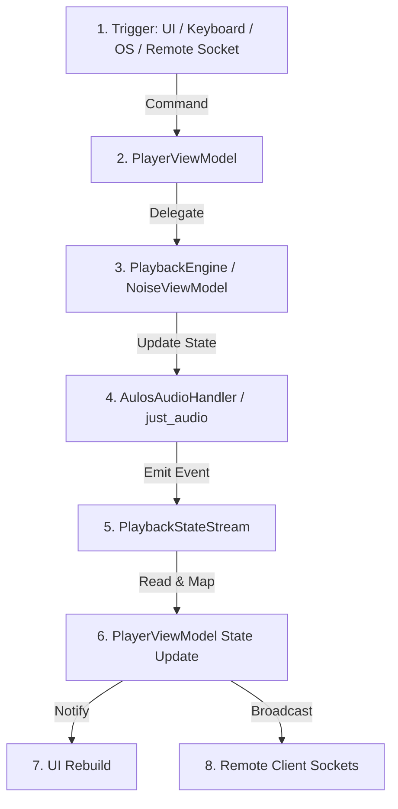

# Playback Controls: Source of Truth

## Summary
This document serves as the master specification for how playback controls (play, pause, toggle, skip, seek, etc.) behave across all triggers, interfaces, and platforms in Aulos. Playback controls are routed through a unidirectional command-to-state flow to ensure consistent state representation.

---

## 1. Unidirectional Control & State Flow
Regardless of the input source, all control actions follow a strict routing sequence to prevent race conditions:

---

## 2. Playback Control Entry Points

The application processes play, pause, and skip commands from four primary entry points:

### A. In-App User Interface (UI)
* **Persistent Bottom Player Bar (`persistent_player_bar.dart`)**:
  - Displays a unified play/pause button.
  - Toggles state by calling `PlayerViewModel.togglePlay()`.
* **Now Playing Controls (`now_playing_controls.dart` & `collapsed_player_screen.dart`)**:
  - Renders contextual control sets mapped dynamically based on the active `MediaType` (via Strategy Pattern).
  - Standard commands: `PlayerViewModel.play()`, `PlayerViewModel.pause()`, `PlayerViewModel.togglePlay()`, `PlayerViewModel.skipNext()`, `PlayerViewModel.skipPrevious()`, `PlayerViewModel.seek()`, `PlayerViewModel.setSpeed()`.

### B. Hardware Keyboard & System Media Keys
Captured globally at the application root level in `lib/main.dart` using `HardwareKeyboard.instance.addHandler`:
1.  **Media Keys**:
    * `LogicalKeyboardKey.mediaPlayPause` $\rightarrow$ calls `PlayerViewModel.togglePlay()`.
    * `LogicalKeyboardKey.mediaPlay` $\rightarrow$ calls `PlayerViewModel.play()`.
    * `LogicalKeyboardKey.mediaPause` $\rightarrow$ calls `PlayerViewModel.pause()`.
    * `LogicalKeyboardKey.mediaStop` $\rightarrow$ calls `PlayerViewModel.stop()`.
    * `LogicalKeyboardKey.mediaTrackNext` $\rightarrow$ calls `PlayerViewModel.skipNext()`.
    * `LogicalKeyboardKey.mediaTrackPrevious` $\rightarrow$ calls `PlayerViewModel.skipPrevious()`.
2.  **Spacebar Key**:
    * Toggles play/pause $\rightarrow$ calls `PlayerViewModel.togglePlay()`.
    * **Focus Safety Guard**: Must verify that the current primary focus (`FocusManager.instance.primaryFocus`) is NOT an `EditableText` or nested inside a text field. If a text field is active, spacebar input must write a space character instead of triggering playback actions.

### C. System OS Media Controls & Headset Buttons
Handled via `AulosAudioHandler` (wrapping `BaseAudioHandler` from `package:audio_service/audio_service.dart`):
* **Trigger Sources**: OS notification drawer widgets, lock screen media widgets, system volume overlays, and hardware buttons on wired/Bluetooth headsets (e.g. single click to toggle, double-clicks to skip).
* **Execution Flow**:
  1. OS routes event to `AulosAudioHandler`.
  2. Handler overrides standard actions: `play()`, `pause()`, `stop()`, `seek()`, `skipToNext()`, `skipToPrevious()`.
  3. `play()`, `pause()`, `stop()`, and `seek()` directly control the underlying `just_audio` player instance.
  4. `skipToNext()` and `skipToPrevious()` emit events to `PlayerViewModel` via the custom `externalCommandStream`.
  5. `PlayerViewModel` listens to `externalCommandStream` and triggers queue skip operations.

### D. Wireless Remote Sockets (Host/Client Mode)
* **Trigger Sources**: Connected remote control device nodes sending JSON-serialized `MediaCommand` packets over WebSocket.
* **Execution Flow**:
  1. `ConnectionManager` receives `MediaCommand` over socket stream.
  2. If authenticated and role is **Host**, forwards commands to `PlayerViewModel._handleRemoteCommand()`.
  3. Executed commands: `CommandType.play`, `CommandType.pause`, `CommandType.skipNext`, `CommandType.seek`.
  4. Host updates the native engine state and broadcasts the updated metadata, position, and play state to all connected client nodes.

---

## 3. Media-Specific Play/Pause Behaviors

Playback controls alter their behaviors contextually based on the active `MediaType`:

| Media Type | Play / Pause Behavior | Seek / Duration Behavior |
| :--- | :--- | :--- |
| **Music** | Controls the main `PlaybackEngine`. | Standard seek slider. Displays duration. |
| **Podcast** | Controls the main `PlaybackEngine`. | Standard seek slider. Automatically saves playback position every 10s; resumes from last position on load. |
| **Audiobook** | Controls the main `PlaybackEngine`. | Standard seek slider. Automatically saves playback position every 10s; resumes from last position on load. |
| **Radio** | Controls the main `PlaybackEngine`. | Disabled seek bar. Infinite/live stream duration. |
| **Ambient Noise** | Redirects control flow to `NoiseViewModel` (`restoreActiveMix` / `stopAll`) instead of the main `PlaybackEngine`. | Disabled seek bar. Infinite loop duration. |

---

## 4. Safety Constraints & Debouncing
* **Skip Debouncing**: Double-clicking system media next/previous buttons is guarded in `PlayerViewModel` using `_lastSkipTime`. Inward skip commands within 1 second of the last skip event are ignored to prevent stack overflows and database write locks.
* **Noise Loop Separation**: The main `PlaybackEngine` is stopped when entering `MediaType.noise` loops. Active sound mixers are cleared when loading standard tracks, ensuring sound scopes do not bleed.
